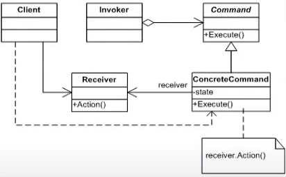

# Splendid-pdf telegram-bot

Настройка Webhook:
  1) Скачиваем https://ngrok.com/download и запускам его
  2) Прописываем комманду **ngrok http {port}**
  3) Проходим по адресу https://api.telegram.org/bot[TOKEN]/setWebhook?url=[URL] заполнив токеном бота и адресом, который получили во втором шаге

### Команды бота:
* */start* - запуск бота

### Использованные паттерны проектирования GoF:

* **Command Pattern**

* class Invoker(CommandContext) >>> 
* interface Command(MainMenuCommand) >>> 
* class Concrete Command(class implement interface MainMenuCommand) >>> 
* class Receiver(InlineKeyboard)